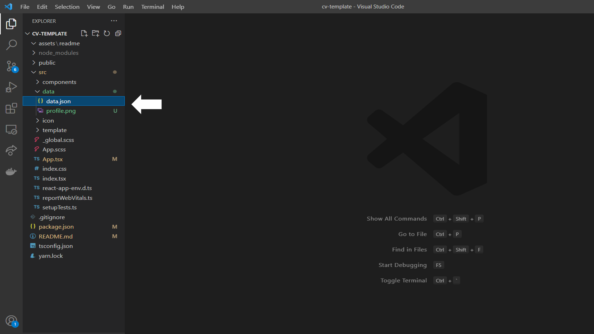
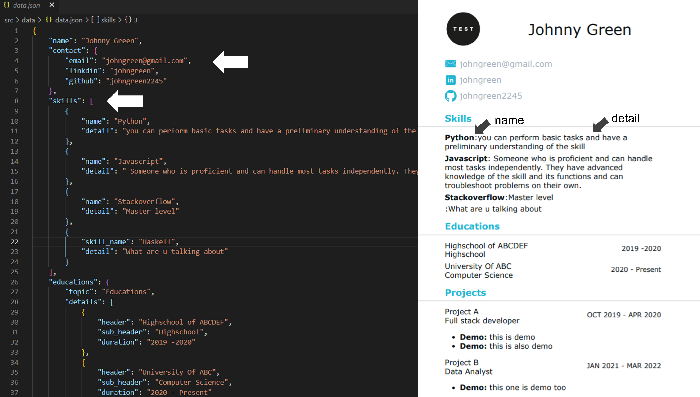
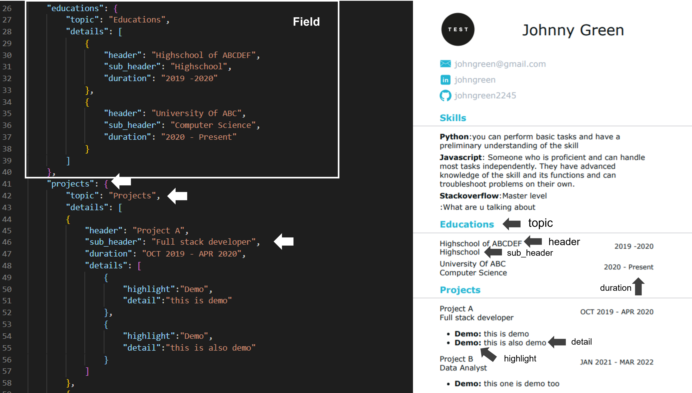
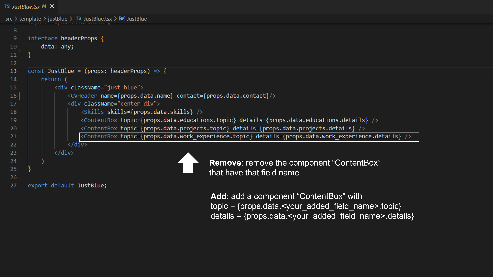
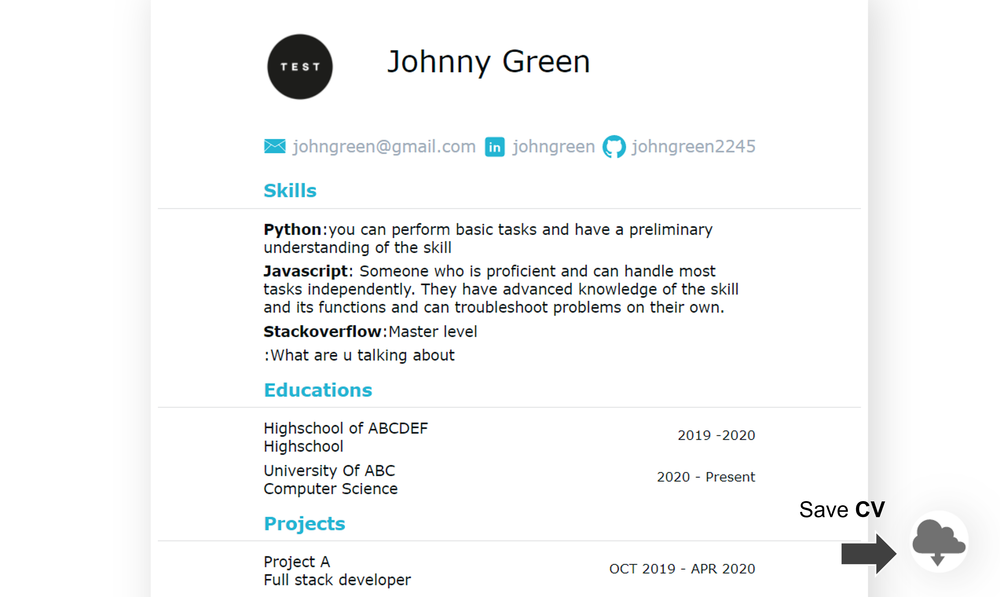
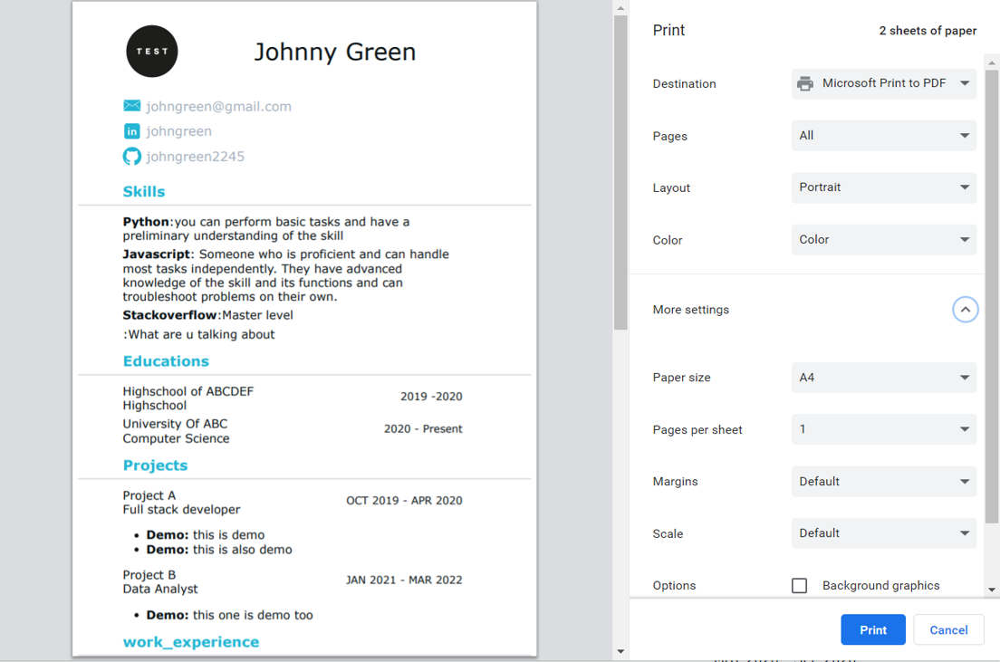

# CV Template
The web app for modifying and viewing CV before printing CV as pdf.

Current release feature

* Displaying the CV of the user by modifying json profile picture and a few line of code.

## Prerequisites
these Prerequisites can be installed by
* [Node.js](https://nodejs.org/en/download/) 
* [Yarn](https://classic.yarnpkg.com/lang/en/docs/install/#windows-stable)

## Demo
Get access to the project
```
```
Run program:
```
cd cv-template/
yarn install
yarn start
```

## User Guide Book

Before using the application 
[This](https://www.w3schools.com/js/js_json_intro.asp) may give you a brief idea about JSON.

* After the program is run goto src/data
* replace the 'profile.png' to your picture and renamed it as 'profile.png'
  


* Modify your name and skill sets that you have in data.json file
  


* Modify your data in another field as shown
* user may make/remove a field: work experience that located below the skill
  


* If user add/remove a field: work experience, user have to add/remove components in the template
  


* Hit save button on the bottom right
  


* Choose paper size and additional setting
* PRINT YOUR CV

